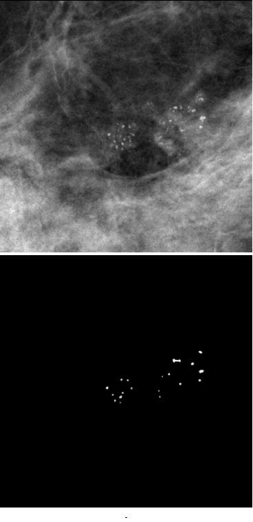

  <h3 align="center">DICOM PreProcess</h3>


<!-- TABLE OF CONTENTS -->
<details open="open">
  <summary><h2 style="display: inline-block">Table of Contents</h2></summary>
  <ol>
    <li>
      <a href="#about-the-project">About The Project</a>
      <ul>
        <li><a href="#built-with">Built With</a></li>
      </ul>
    </li>
    <li>
      <a href="#getting-started">Getting Started</a>
      <!--<ul>
        <li><a href="#prerequisites">Prerequisites</a></li>-->
        <li><a href="#installation">Installation</a></li>
      </ul>
    </li>
    <li><a href="#usage">Usage</a></li>
    <!--<li><a href="#roadmap">Roadmap</a></li>
    <li><a href="#contributing">Contributing</a></li>-->
    <li><a href="#license">License</a></li>
    <li><a href="#contact">Contact</a></li>
    <li><a href="#references">References</a></li>
  </ol>
</details>


<!-- ABOUT THE PROJECT -->
## About The Project

This project was realized within the framework of the end of studies project aiming at obtaining the diploma of engineer in applied data processing. In this context, the main idea of this project is to develop a medical image processing library using a service-oriented architecture.
### Built With

* [Python](https://www.python.org/)
* [Numpy](https://numpy.org/)
* [Pydicom](https://pydicom.github.io/)
* [Flask](https://flask.palletsprojects.com/en/2.0.x/#)
* [Cornerstone](https://docs.cornerstonejs.org/)
* [Docker](https://www.docker.com/)
* [Numba-CUDA](https://numba.pydata.org/numba-doc/dev/cuda/index.html)


<!-- GETTING STARTED -->
## Getting Started

### Installation

1. Clone the repo
   ```sh
   $ git clone https://github.com/HamzaGbada/dicomPreProcess.git
   ```
2. Docker Build Image
   ```sh
   $ docker build -t dicomPreProcess .
   ```


<!-- USAGE EXAMPLES -->

## Usage

Once done, run the Docker image and map the port to whatever you wish on
your host to test the web dashbord. In this example, we simply map port 5000 of the host to
port 5000 of the Docker:

```sh
$ docker run -d -p 5000:5000 --name dicomImage dicomPreProcess -d
```
Verify the deployment by navigating to your server address in
your preferred browser (or you can use Postman to test API).

```sh
127.0.0.1:5000
```
 To test the implemented algorithms separately:
 ```sh
$ docker exec -it dicomImage /bin/bash
```
```sh
$ python run.py -h

    usage: run.py [-h] [-a ALGORITHM] [-m METHOD] -f FILE

    Description of your Dicom PreProcess
    
    optional arguments:
      -h, --help            show this help message and exit
      -a ALGORITHM, --algorithm ALGORITHM
                            Choose the algorithm to use. It can be "grail" or "fedbs"
      -m METHOD, --method METHOD
                            Choose the method to use. It can be "dog", "log" or "bbp". This command is validated if and only if the "fedbs" algorithm is chosen
      -f FILE, --file FILE  Choose the DICOM file path to be processed by default the file is located "data/"

```

For exemple if you want to test _FEDBS_ algorithm for micro-calcification detection on the file _20587054.dcm_:
 ```sh
$ python run.py -a fedbs -m dog -f 20587054.dcm
```



<!-- LICENSE -->

## License

Distributed under the MIT License. See `LICENSE` for more information.


<!-- CONTACT -->
## Contact

Your Name - [Hamza Gbada](https://www.linkedin.com/in/hamzagbada/)

Project Link: [HamzaGbada/dicomPreProcess](https://github.com/HamzaGbada/dicomPreProcess)


<!-- References -->

## References

* [GRAIL](https://aapm.onlinelibrary.wiley.com/doi/pdf/10.1002/mp.12144)
* [FEDBS](https://www.eijst.org.uk/images/frontImages/gallery/Vol._5_No._3/7._51-63.pdf)


